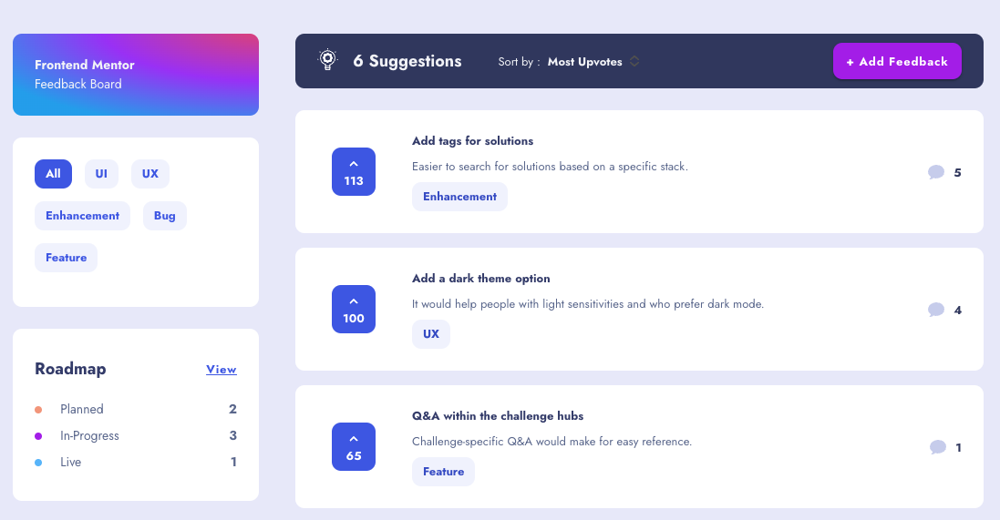

# Frontend Mentor - Product feedback app solution

This is a solution to the [Product feedback app challenge on Frontend Mentor](https://www.frontendmentor.io/challenges/product-feedback-app-wbvUYqjR6). Frontend Mentor challenges help you improve your coding skills by building realistic projects.

## Table of contents

- [The challenge](#the-challenge)
- [Screenshot](#screenshot)
- [Links](#links)
- [My process](#my-process)
- [Built with](#built-with)
- [Continued development](#continued-development)

## Overview

### The challenge

Users should be able to:

- [x] View the optimal layout for the app depending on their device's screen size
- [x] See hover states for all interactive elements on the page
- [x] Create, read, update, and delete product feedback requests
- [ ] Receive form validations when trying to create/edit feedback requests
- [x] Sort suggestions by most/least upVotes and most/least comments
- [x] Filter suggestions by category
- [x] Add comments and replies to a product feedback request
- [x] Upvote product feedback requests
- [x] Keep track of any changes, even after refreshing the browser (`localStorage` could be used for this if you're not building out a full-stack app)

### Screenshot

### Links

- Solution URL: [Add solution URL here](https://your-solution-url.com)
- Live Site URL: [https://ionic-product-feedback.netlify.app](https://ionic-product-feedback.netlify.app)

## My process

- Implemented required data types as interfaces
- Started with a mobile-first approach building all pages for small screen sizes
- Adapted views for tablet and desktop
- Added Elf Store to handle data and local storage
- Implemented all button and form functionality 
- Adjusting fine details

### Built with

- [Ionic 7](https://ionicframework.com/)
- [Angular 15](https://angular.io/)
- [Elf Store](https://ngneat.github.io/elf/)

### Continued development

- [ ] Add Confirmation for delete action
- [ ] Add Toasts for status updates
- [ ] Add darkmode
- [ ] Implement supabase as backend
